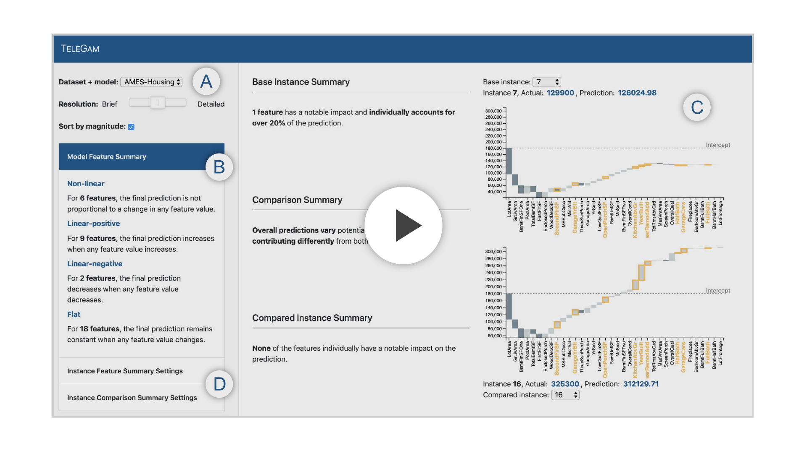

# TeleGam
*Combining Visualization and Verbalization for Interpretable Machine Learning*

TeleGam is a prototype system that demonstrates how visualizations and verbalizations can collectively support interactive interpretation of machine learning models, for example, generalized additive models (GAMs).


<!-- []() -->

***

## Live Demo

For a live demo, visit: [poloclub.github/io/telegam][demo]


## Installation and Running Locally

Download or clone this repository:

```bash
git clone https://github.com/poloclub/telegam.git
```

Within the cloned repo, run a web server:

```bash
python -m http.server 
```


## License

MIT License. See [`LICENSE.md`](LICENSE.md).


## Citation

**TeleGam: Combining Visualization and Verbalization for Interpretable Machine Learning**  
Fred Hohman, Arjun Srinivasan, Steven Drucker  
*IEEE Visualization Conference (VIS). Vancouver, Canada, 2019.*


## Contact

For questions or support [open an issue][issues].

[npm]: https://www.npmjs.com
[issues]: https://github.com/poloclub/telegam/issues
[demo]: https://poloclub.github.io/telegam/
